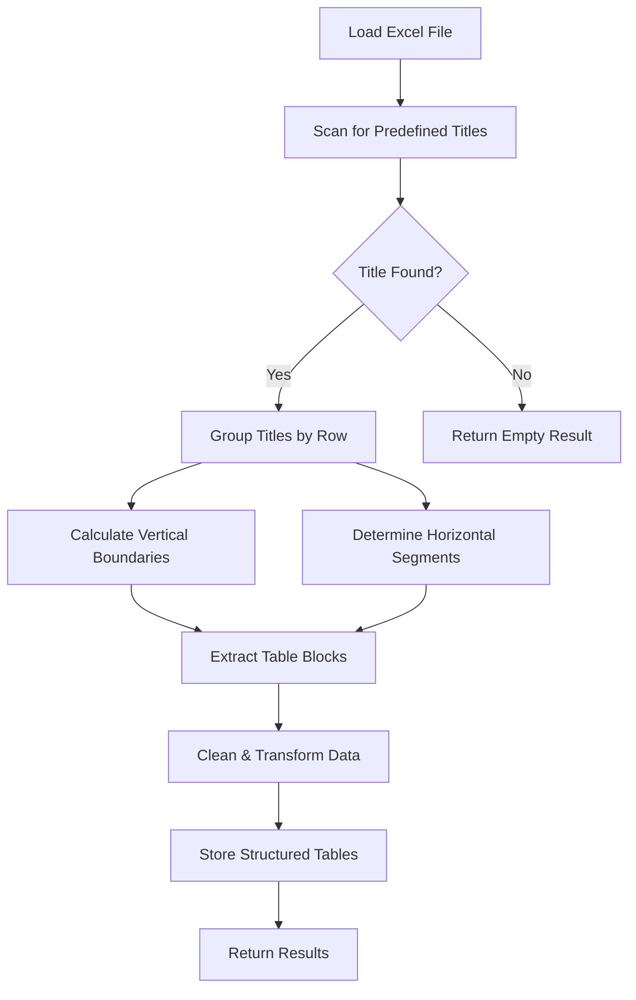

# Excel Processor API

&#x20;&#x20;

A FastAPI–based web service for processing Excel files and extracting structured table data based on predefined table titles.

## 🚀 Overview

This application processes Excel files (`.xls`/`.xlsx`) and extracts tables using a **title‑anchored boundary detection** algorithm. It solves common table extraction challenges like fragmentation, sparse data handling, and irregular layouts. The API supports file uploads, table listing, table details retrieval, row calculations–and now debug metadata retrieval.

## ✨ Features

- **Intelligent Table Extraction**: Anchor-based detection with boundary calculation (implemented in `utils.locate_table_titles`, `calculate_row_boundaries`, `determine_horizontal_boundaries`)
- **Multi-Engine Support**: Handles both `.xls` and `.xlsx` formats (`pandas.read_excel` uses `engine="xlrd"` and built-in support for `.xlsx`)
- **Fragmentation Prevention**: Horizontal segmentation & overlap tracking (see `utils.find_tables_in_spreadsheet`, `already_used` grid)
- **Advanced Data Cleaning**: Configurable thresholds for empty rows/columns (`utils.filter_rows_columns`, default 0.6 ratios)
- **Duplicate Handling**: Automatic disambiguation of duplicate table titles (`utils.find_tables_in_spreadsheet` title\_counts logic)
- **Row Calculations**: Numeric sum calculations with robust error handling (`main.row_sum` iterates with `float()` and skips non-numeric)
- **Flexible Name Matching**: Exact, case-insensitive, and partial table/row name lookups, with suggestion lists on 404 errors (`main.find_table_name` & `main.find_row_name`)
- **Consistent Error Responses**: Custom HTTP exception handler returning structured JSON `{ "error": "..." }` (`main.http_error_handler`)
- **Debug Metadata Endpoint**: Inspect matching details and raw table slices for troubleshooting (`/debug_table` in `main.py`)
- **Health Check Endpoint**: Simple `/` ping returning status and message (`main.app.get('/')`)
- **API Documentation**: Auto-generated OpenAPI/Swagger docs (FastAPI default, available at `/docs`)
- **File Validation**: Size limits, format validation, and content verification (`main.upload_excel` checks extension and handles errors)

## 📊 Supported Table Titles

Exact titles the app will extract (case‑sensitive):

- `INITIAL INVESTMENT`
- `CASHFLOW DETAILS`
- `DISCOUNT RATE`
- `WORKING CAPITAL`
- `GROWTH RATES`
- `SALVAGE VALUE`
- `OPERATING CASHFLOWS`
- `BOOK VALUE & DEPRECIATION`
- `Investment Measures`

---

## 🧠 Solution Architecture



### Core Algorithm Explained

#### Title Location Scanning
- Scans every cell for exact title matches
- Records (row, col, title) for all occurrences

#### Vertical Boundary Calculation
- Tables extend down to the next title row (or end of sheet)
- Avoids splitting a single block across blank rows

#### Horizontal Segmentation
- If multiple titles share a row, splits the row into discrete segments
- Each segment belongs exclusively to its title

#### Overlap Prevention
- Marks every cell used by an extracted table
- Prevents adjacent tables from merging or double‑counting

#### Adaptive Data Cleaning
- Drops rows/columns > 60% empty
- Trims leading/trailing blank runs longer than one row/column

## 🚧 Development Challenges & Solutions

### Challenges Encountered

#### Breadth‑First Search (BFS) Approach
- **Problem**: Irregular table shapes caused fragmentation
- **Issue**: Parts of the same visual table treated as separate tables
- **Solution**: Replaced with title‑based anchoring and explicit boundary logic

#### Direct Row/Column Empty Cell Detection
- **Problem**: Intentional spacing caused false splits
- **Issue**: Table headers separated from their data blocks
- **Solution**: Implemented configurable empty‑cell thresholds (e.g. drop rows/cols > 60% empty)

#### Excel Metadata and Grouping
- **Problem**: Inconsistent metadata across different source files
- **Issue**: Ungrouped or sparsely formatted tables were missed entirely
- **Solution**: Content‑based detection via exact title matches and boundary inference

#### Undefined Table Boundaries
- **Challenge**: Tables without clearly demarcated end rows or columns
- **Problem**: Data following blank lines could be omitted
- **Solution**: Gap analysis with streak counting to trim only intentional blank edges

#### Single File Pattern Recognition
- **Challenge**: Only one sample layout provided for development
- **Problem**: Unknown variability in other potential files
- **Solution**: Flexible boundary calculation that adapts to arbitrary title positions

### Solution Benefits
- **Reliability**: Consistent extraction regardless of table positioning
- **Flexibility**: Handles various table layouts, side‑by‑side and vertical groupings
- **Robustness**: Graceful handling of malformed or sparse tables
- **Maintainability**: Easy to extend by adding new exact table titles

## 🧪 Testing

### Test Cases

#### Adjacent Tables Test
Verify that side‑by‑side tables on the same row do not merge into one block.

#### Sparse Table Test
Confirm that tables with up to 60% empty rows/columns are still preserved as single tables.

#### Duplicate Title Test
Check that multiple occurrences of the same title (e.g. two "DISCOUNT RATE" blocks) get disambiguated (DISCOUNT RATE (1), DISCOUNT RATE (2)).

#### Edge Table Test
Validate that a table at the bottom of the sheet (no following title) extracts fully down to the last row.

#### Empty‑Sheet Test
Upload an entirely blank Excel sheet → expect a clear error "No tables found" (HTTP 400).

#### Non‑Numeric‑Rows Test
Request /row_sum on a row with no numeric cells → should return sum: 0.0, not an error.

#### Malformed‑Title Test
Provide a sheet where a title is misspelled → ensure that block is not extracted (exact matching).

#### Merged‑Cell Test
Use merged header/data cells → verify they appear as single string entries, not split or dropped.


## 📋 API Endpoints

### 1. Upload Excel File

```http
POST /upload_excel
```

**Functionality**: Upload and process an Excel file to extract tables.

**Request**:

- `Content-Type`: multipart/form-data
- Body: file field named `file`

**Response**:

```json
{
  "tables": ["INITIAL INVESTMENT", "CASHFLOW DETAILS", "DISCOUNT RATE"]
}
```

---

### 2. Debug Table

```http
GET /debug_table?table_name=YOUR_TABLE_NAME
```

**Functionality**: Returns raw metadata about a specific table, including match details and a preview of its data.

**Query Parameters**:

- `table_name` (string, required): The (partial or case‑insensitive) table name to debug.

**Response**:

```json
{
  "requested_name": "discount rate",
  "actual_table_name": "DISCOUNT RATE",
  "num_rows": 12,
  "num_cols": 4,
  "first_5_rows": [
    ["DISCOUNT RATE", "", "", ""],
    ["Year", "0", "1", "2"],
    ...
  ],
  "all_first_cells": ["DISCOUNT RATE", "Year", ...]
}
```

---

### 3. List Tables

```http
GET /list_tables
```

**Functionality**: List all extracted table names.

**Response**:

```json
{
  "tables": ["INITIAL INVESTMENT", "CASHFLOW DETAILS", "DISCOUNT RATE"]
}
```

### 4. Get Table Details

```http
GET /get_table_details?table_name=INITIAL%20INVESTMENT
```

**Functionality**: Return the row labels (first‑column values) for the specified table.

**Response**:

```json
{
  "table_name": "INITIAL INVESTMENT",
  "row_names": [
    "Initial Investment=",
    "Opportunity cost (if any)=",
    "Lifetime of the investment",
    "Salvage Value at end of project=",
    "Deprec. method(1:St.line;2:DDB)=",
    "Tax Credit (if any )=",
    "Other invest.(non-depreciable)="
  ]
}
```

### 5. Calculate Row Sum

```http
GET /row_sum?table_name=INITIAL%20INVESTMENT&row_name=Tax%20Credit%20(if%20any%20)%3D
```

**Functionality**: Sum all numeric values in the given row (ignoring non‑numeric cells).

**Response**:

```json
{
  "table_name": "INITIAL INVESTMENT",
  "row_name": "Tax Credit (if any )=",
  "sum": 0.1
}
```

### 6. Health Check

```http
GET /
```

**Functionality**: Verify the API is running.

**Response**:

```json
{
  "message": "Excel Processor API is running",
  "status": "ok"
}
```

---


## Potential Improvements

- **Multiple‑Sheet Support**: Detect and extract tables from all sheets, not just the first.
- **Alternate Formats**: Handle CSV, Google Sheets exports, or OpenDocument spreadsheets.
- **Enhanced Calculations**: Support percent formatting, currency conversion, and custom aggregations.
- **Batch Processing**: Allow uploading and processing multiple files in one request.
- **UI Dashboard**: Build a simple React/Vue frontend to upload files and display tables visually.
- **Export Features**: CSV/JSON/Excel exports of individual tables.
- **Plugin Architecture**: Let users register new table‑title patterns via configuration files.
- **Adaptive Pattern Learning** : If provided with a larger corpus of Excel files, develop robust, data-driven logic (e.g., machine learning or adaptive heuristics) to automatically identify and generalize table patterns across varied layouts.


## Missed Edge Cases & Examples

- **Entirely Blank Workbook**  
  *Scenario*: You upload a `.xlsx` with no filled cells.  
  *Expected Behavior*: API returns HTTP 400 "No tables found in the uploaded Excel file."

- **Tables with Zero Numeric Cells**  
  *Scenario*: A "COST BREAKDOWN" table where every cell is text ("High", "Medium", "Low").  
  *Expected Behavior*: Calling `/row_sum?table_name=COST BREAKDOWN&row_name=High` returns `{ "sum": 0.0 }` rather than an error.

- **Malformed or Partially Matching Titles**  
  *Scenario*: The sheet contains "INIITAL INVESTMENT" (typo) instead of "INITIAL INVESTMENT".  
  *Expected Behavior*: No table is extracted for that header, and `/list_tables` simply omits it; requests for that name return 404.

- **Merged Cells Spanning Multiple Columns**  
  *Scenario*: "OPERATING CASHFLOWS" header is a merged cell across A1:C1, with data beneath.  
  *Expected Behavior*: The extractor treats the merged region as one column labeled "OPERATING CASHFLOWS", not three separate empty columns.

- **Hidden Rows/Columns**  
  *Scenario*: Row 3 (a header) or Column D (data) is hidden in Excel.  
  *Expected Behavior*: Decide whether hidden rows should be ignored or included; currently they're treated like any other cell, which may be surprising.

- **Locale‑Specific Number Formats**  
  *Scenario*: German locale entries like "1 234,56" (space thousands, comma decimal).  
  *Expected Behavior*: Our `float()` conversions fail; we'd need to pre‑process or specify locale to parse correctly.

- **Cells Containing Formulas**  
  *Scenario*: A cell holds `=SUM(B2:B5)` instead of the computed result.  
  *Expected Behavior*: Pandas reads the literal formula text; sums should instead use the evaluated numeric result.

- **Multiple Sheets with Identical Titles**  
  *Scenario*: Both Sheet1 and Sheet2 include a table called "INITIAL INVESTMENT."  
  *Expected Behavior*: Without sheet‑scoping, one will overwrite the other; optionally prefix table names with sheet names.

- **Highly Irregular Layouts**  
  *Scenario*: A table where 50% of rows and 50% of columns are blank (visual spacing).  
  *Expected Behavior*: With our 60% threshold it survives; if the threshold changes it could be dropped unintentionally.


## 📬 Postman Collection

You can import our Postman collection to quickly test all endpoints:

- File: [`postman_collection.json`](./postman_collection.json)
- Contains requests for Health Check, Upload Excel, List Tables, Get Table Details, Calculate Row Sum, and Debug Table.


## 📦 Dependencies

```txt
annotated-types==0.7.0
anyio==4.9.0
click==8.2.1
colorama==0.4.6
et_xmlfile==2.0.0
fastapi==0.115.13
h11==0.16.0
idna==3.10
numpy==2.3.0
openpyxl==3.1.5
pandas==2.3.0
pydantic==2.11.7
pydantic_core==2.33.2
python-dateutil==2.9.0.post0
python-multipart==0.0.20
pytz==2025.2
six==1.17.0
sniffio==1.3.1
starlette==0.46.2
typing-inspection==0.4.1
typing_extensions==4.14.0
tzdata==2025.2
uvicorn==0.34.3
xlrd==2.0.2
```

## 🚀 Deployment

### Production
```bash
uvicorn main:app --host 0.0.0.0 --port 9090 --workers 4
```
