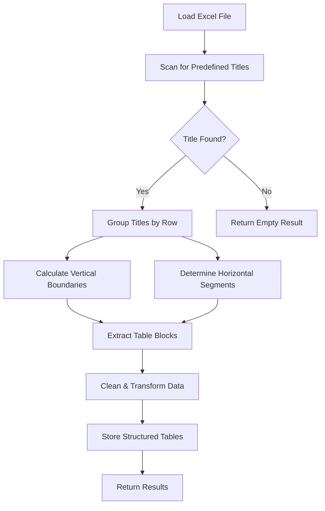

# Excel Processor API


A FastAPI‑based web service for processing Excel files and extracting structured table data based on predefined table titles.

## 🚀 Overview

This application processes Excel files (`.xls`/`.xlsx`) and extracts tables using a **title‑anchored boundary detection** algorithm. It solves common table extraction challenges like fragmentation, sparse data handling, and irregular layouts. The API supports file uploads, table listing, table details retrieval, and row calculations.

## ✨ Features

- **Intelligent Table Extraction**: Anchor‑based detection with boundary calculation  
- **Multi‑Engine Support**: Handles both `.xls` and `.xlsx` formats  
- **Fragmentation Prevention**: Horizontal segmentation & overlap tracking  
- **Advanced Data Cleaning**: Configurable thresholds for empty rows/columns  
- **Duplicate Handling**: Automatic disambiguation of duplicate table titles  
- **Row Calculations**: Numeric sum calculations with robust error handling  
- **API Documentation**: Auto‑generated OpenAPI/Swagger docs  
- **File Validation**: Size limits, format validation, and content verification  

## 📊 Supported Table Titles

Exact titles the app will extract (case‑sensitive):

- `INITIAL INVESTMENT`
- `CASHFLOW DETAILS`
- `DISCOUNT RATE`
- `WORKING CAPITAL`
- `GROWTH RATES`
- `SALVAGE VALUE`
- `OPERATING CASHFLOWS`
- `BOOK VALUE & DEPRECIATION`
- `Investment Measures`

---

## 🧠 Solution Architecture



### Core Algorithm Explained

#### Title Location Scanning
- Scans every cell for exact title matches
- Records (row, col, title) for all occurrences

#### Vertical Boundary Calculation
- Tables extend down to the next title row (or end of sheet)
- Avoids splitting a single block across blank rows

#### Horizontal Segmentation
- If multiple titles share a row, splits the row into discrete segments
- Each segment belongs exclusively to its title

#### Overlap Prevention
- Marks every cell used by an extracted table
- Prevents adjacent tables from merging or double‑counting

#### Adaptive Data Cleaning
- Drops rows/columns > 60% empty
- Trims leading/trailing blank runs longer than one row/column

## 🚧 Development Challenges & Solutions

### Challenges Encountered

#### Breadth‑First Search (BFS) Approach
- **Problem**: Irregular table shapes caused fragmentation
- **Issue**: Parts of the same visual table treated as separate tables
- **Solution**: Replaced with title‑based anchoring and explicit boundary logic

#### Direct Row/Column Empty Cell Detection
- **Problem**: Intentional spacing caused false splits
- **Issue**: Table headers separated from their data blocks
- **Solution**: Implemented configurable empty‑cell thresholds (e.g. drop rows/cols > 60% empty)

#### Excel Metadata and Grouping
- **Problem**: Inconsistent metadata across different source files
- **Issue**: Ungrouped or sparsely formatted tables were missed entirely
- **Solution**: Content‑based detection via exact title matches and boundary inference

#### Undefined Table Boundaries
- **Challenge**: Tables without clearly demarcated end rows or columns
- **Problem**: Data following blank lines could be omitted
- **Solution**: Gap analysis with streak counting to trim only intentional blank edges

#### Single File Pattern Recognition
- **Challenge**: Only one sample layout provided for development
- **Problem**: Unknown variability in other potential files
- **Solution**: Flexible boundary calculation that adapts to arbitrary title positions

### Solution Benefits
- **Reliability**: Consistent extraction regardless of table positioning
- **Flexibility**: Handles various table layouts, side‑by‑side and vertical groupings
- **Robustness**: Graceful handling of malformed or sparse tables
- **Maintainability**: Easy to extend by adding new exact table titles

## 🧪 Testing

### Test Cases

#### Adjacent Tables Test
Verify that side‑by‑side tables on the same row do not merge into one block.

#### Sparse Table Test
Confirm that tables with up to 60% empty rows/columns are still preserved as single tables.

#### Duplicate Title Test
Check that multiple occurrences of the same title (e.g. two "DISCOUNT RATE" blocks) get disambiguated (DISCOUNT RATE (1), DISCOUNT RATE (2)).

#### Edge Table Test
Validate that a table at the bottom of the sheet (no following title) extracts fully down to the last row.

#### Empty‑Sheet Test
Upload an entirely blank Excel sheet → expect a clear error "No tables found" (HTTP 400).

#### Non‑Numeric‑Rows Test
Request /row_sum on a row with no numeric cells → should return sum: 0.0, not an error.

#### Malformed‑Title Test
Provide a sheet where a title is misspelled → ensure that block is not extracted (exact matching).

#### Merged‑Cell Test
Use merged header/data cells → verify they appear as single string entries, not split or dropped.

## 📋 API Endpoints

### 1. Upload Excel File
```http
POST /upload_excel
```
**Functionality**: Upload and process an Excel file to extract tables.

**Request**:
- Content‑Type: multipart/form-data
- Body: file field named `file`

**Response**:
```json
{
  "tables": ["INITIAL INVESTMENT", "CASHFLOW DETAILS", "DISCOUNT RATE"]
}
```

### 2. List Tables
```http
GET /list_tables
```
**Functionality**: List all extracted table names.

**Response**:
```json
{
  "tables": ["INITIAL INVESTMENT", "CASHFLOW DETAILS", "DISCOUNT RATE"]
}
```

### 3. Get Table Details
```http
GET /get_table_details?table_name=INITIAL%20INVESTMENT
```
**Functionality**: Return the row labels (first‑column values) for the specified table.

**Response**:
```json
{
  "table_name": "INITIAL INVESTMENT",
  "row_names": [
    "Initial Investment=",
    "Opportunity cost (if any)=",
    "Lifetime of the investment",
    "Salvage Value at end of project=",
    "Deprec. method(1:St.line;2:DDB)=",
    "Tax Credit (if any )=",
    "Other invest.(non-depreciable)="
  ]
}
```

### 4. Calculate Row Sum
```http
GET /row_sum?table_name=INITIAL%20INVESTMENT&row_name=Tax%20Credit%20(if%20any%20)%3D
```
**Functionality**: Sum all numeric values in the given row (ignoring non‑numeric cells).

**Response**:
```json
{
  "table_name": "INITIAL INVESTMENT",
  "row_name": "Tax Credit (if any )=",
  "sum": 0.1
}
```

### 5. Health Check
```http
GET /
```
**Functionality**: Verify the API is running.

**Response**:
```json
{
  "message": "Excel Processor API is running",
  "status": "ok"
}
```

## Potential Improvements

- **Multiple‑Sheet Support**: Detect and extract tables from all sheets, not just the first.
- **Alternate Formats**: Handle CSV, Google Sheets exports, or OpenDocument spreadsheets.
- **Enhanced Calculations**: Support percent formatting, currency conversion, and custom aggregations.
- **Batch Processing**: Allow uploading and processing multiple files in one request.
- **UI Dashboard**: Build a simple React/Vue frontend to upload files and display tables visually.
- **Export Features**: CSV/JSON/Excel exports of individual tables.
- **Plugin Architecture**: Let users register new table‑title patterns via configuration files.

## Missed Edge Cases

- **Very Large Files**: Handling files >10 MB might require streaming instead of full in‑memory reads.
- **Corrupted or Encrypted Files**: Gracefully reject unreadable workbooks.
- **Deeply Nested Merged Cells**: Complex merges may still fragment tables.
- **International Locales**: Non‑ASCII titles or regional decimal separators ("," vs. ".").
- **Dynamic Table Names**: Titles that change slightly across files (e.g. extra whitespace).

## 📦 Dependencies

```txt
fastapi==0.115.13
uvicorn==0.34.3
pandas==2.3.0
openpyxl==3.1.5
xlrd==2.0.2
pydantic==2.11.7
python-multipart==0.0.20
```

## 🚀 Deployment

### Production
```bash
uvicorn main:app --host 0.0.0.0 --port 9090 --workers 4
```

### Docker
*Docker configuration to be added*
